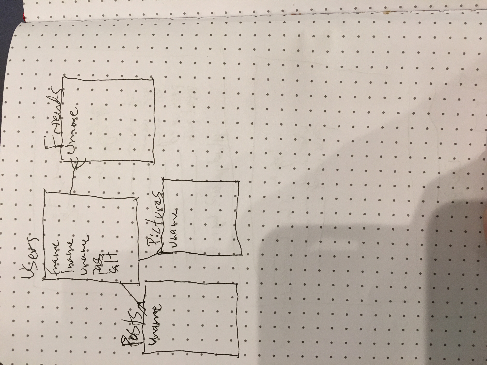
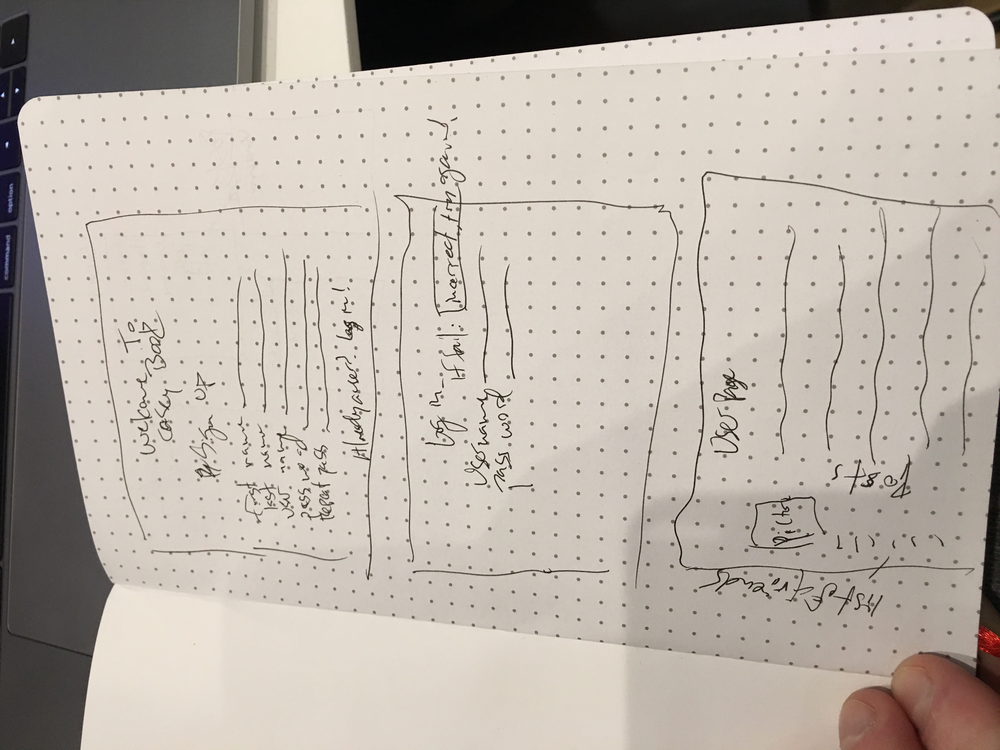

***Casey Harding / February 26, 2018***

# Casey Book
## A facebook clone to practice Express / node / js
### Brief Description:
This project is a rough clone of the popular social media site, facebook.
The user will have the ability to create a new account, update that account
friend other accounts, and delete their account.

#### Technologies Used
1. Javascript
2. EJS
3. HTML
4. CSS
5. Express
6. PSQL
7. pg-promise
8. Morgan
9. Method Override
10. Body Parser
11. Express-Session
12. https://ipinfo.io/ to log users general location

#### Approach Taken
I started by implementing a simple two database system. One for users, and one for the friendship connections between the users. Once I have those set and arranged I would like to move into hashing the passwords and adding a salt to make things secure. I would also like to give the users the option to write on their friends profile page / comment on their own. This would entail another database to handle the comments and threads.

#### How to Use
# DO NOT USE A REAL PASSWORD. CURRENTLY NO PASSWORDS ARE HASHED AND SO ARE VISIBLE TO EVERYONE
Beyond that, you start at the index page and either enter your name and password if you are a returning user or you click the register button where you are taken to a registration page to fill out the required information.

#### Unsolved problems
1. Hash / salt passwords so that they are secure
2. General CSS / HTML beauty upgrades...
3. Add time to userPosts
4. Add date and time user created profile

#### Links and Resources
* https://www.facebook.com
* [Color scheme for facebook] http://www.color-hex.com/color-palette/185
* [database setup for friendships]
http://www.codedodle.com/2014/12/social-network-friends-database.html
* [possible further work for database setup...]
https://www.usenix.org/conference/atc13/technical-sessions/presentation/bronson
* [this was a great resource for first setting up my friendship db]
https://dba.stackexchange.com/questions/1688/how-to-design-a-relationship-database-table-to-store-friendship-relationship/1731#1731
