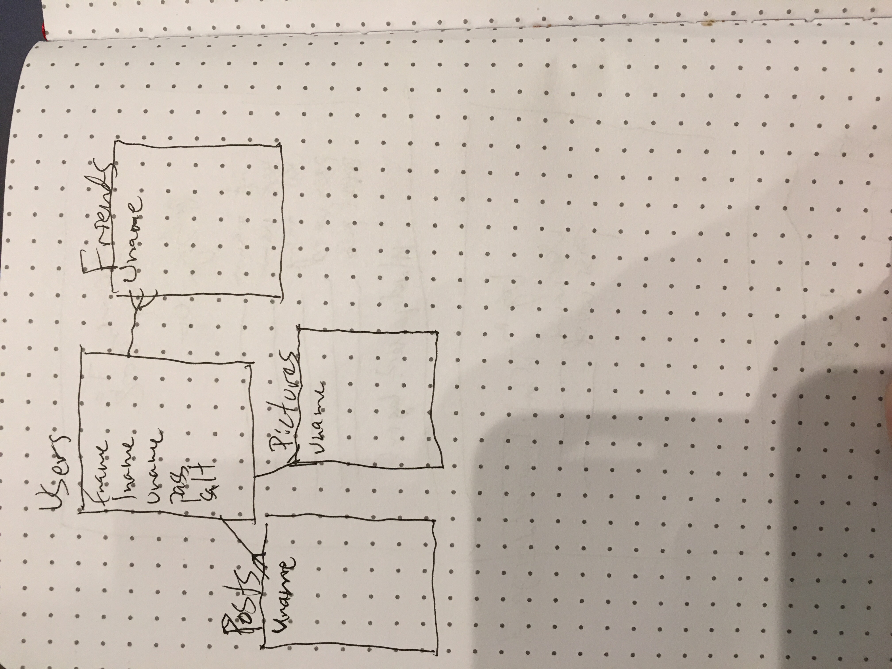
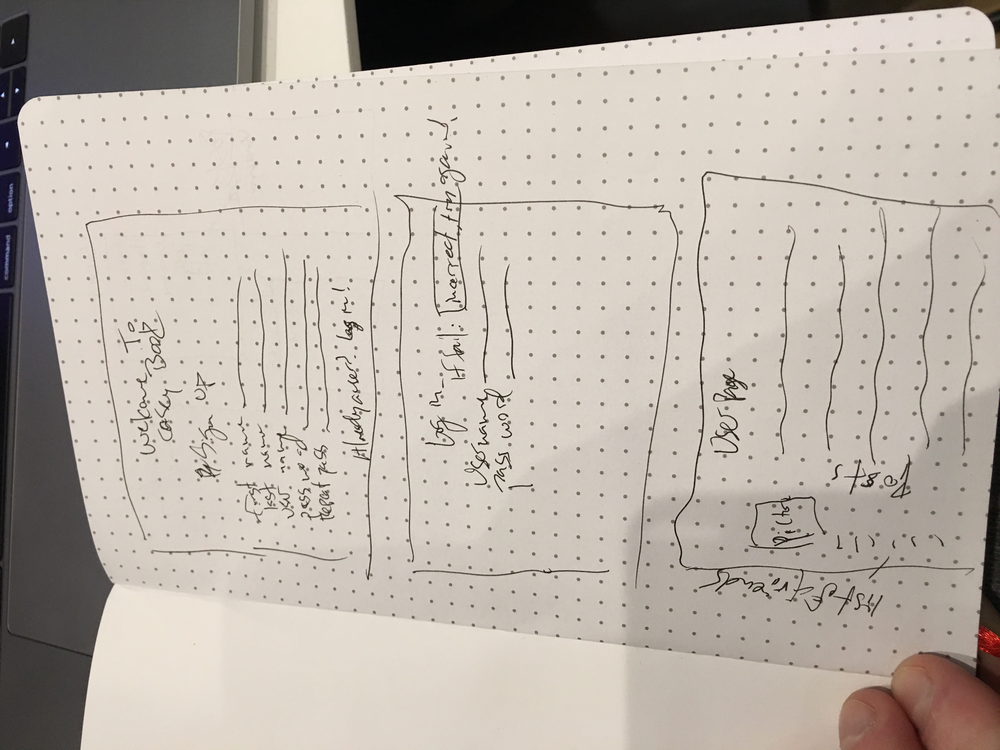

***Casey Harding / February 26, 2018***

# Casey Book
## A facebook clone to practice Express / node / js
### Brief Description:
This project is a rough clone of the popular social media site, facebook.
The user will have the ability to create a new account, update that account
friend other accounts, and delete their account.

#### Technologies Used
1. Javascript
2. EJS
3. HTML
4. CSS
5. Express
6. PSQL
7. pg-promise
8. Morgan
9. Method Override
10. Body Parser
11. Express-Session

#### Approach Taken
I started by implementing a simple two database system. One for users, and one for the friendship
connections between the users. Once I have those set and arranged I would like to move into
hashing the passwords and adding a salt to make things secure. I would also like to give the users
the option to write on their friends profile page / comment on their own. This would entail another
database to handle the comments and threads.

#### How to Use
# DO NOT USE A REAL PASSWORD. CURRENTLY NO PASSWORDS ARE HASHED AND SO ARE VISIBLE TO EVERYONE
Beyond that, you start at the index page and either enter your name and password if you are a
returning user or you click the register button where you are taken to a registration page to
fill out the required information.

#### Unsolved problems
1. Give users the ability to friend other users
2. Give users the ability to fill out a profile that others can see
3. Give users the ability to write on their own wall
4. Give users the ability to comment on others profiles
5. Hash / salt passwords so that they are secure
6. Set up a comments database that keeps track of who wrote what and where so that only the author of the comment can edit it
7. General CSS / HTML beauty upgrades...

#### Links and Resources
* https://www.facebook.com
* [Color scheme for facebook] http://www.color-hex.com/color-palette/185
